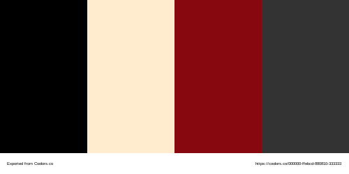

# Hunt Showdown

> TODO Images sizes
> TODO Wireframe Links

## User Experience

This site is a (fake) marketing site for the popular battle-royal & PVE game [Hunt Showdown](https://www.huntshowdown.com/) made by Crytek.
As a Player vs Player, Player vs Environment battle royal game in a fictional Weird West setting this video game offers a refreshing take on battle royale multiplayer games.
Due to a recent growth in popularity Crytek has recently invested in the development of new content and wants to bring even more players into the game.

As a marketing site the main from the site is to enable sales to new and existing players and promote a way for them to keep up to date with new developments.

## Key Information on the Site
+ A description of what Hunt Showdown is.
+ How to buy the main game and it's DLC.
+ A way to sign up for news and get to the social media of the company.
+ Images depicting the main game and its themes.

## User Stories

### Client Goals
+ To be able to view the site on a range of device sizes.
+ To make it easy for potential players to find out what Hunt Showdown is and how to buy it.
+ To allow people to be able to sign up for updates on the game.

### First Time Visitor Goals
+ I would like to know more about the game in order to make a decision should I buy it.
+ I want to be able to navigate the site easily to find information.
+ I would like to be able to be able to go and purchase this game from the site.
+ I would like to be informed of upcoming events, features and community events.

### Returning Players Goals
+ I would like to be able to be able to go and purchase additional content for this game from the site.
+ I would like to be informed of upcoming events, features and community events

## Design Considerations

Initially I looked into building this site desktop first rather than a mobile first, however while this provided ample learning opportunities it was not conducive to good design practice as positioning and sizing became a common cause for code refactors. Ultimately this led to a refactor of the initial build into a mobile responsive site after I had generated the base content in a large screen size.

### Colour

Hunt is an atmospheric horror game and so the colour pallette needed to match this dark theme, to enhance the 'hidden threat' and hiding in the shadows aspects of the game a dark background with contrast coming from lighter text was chosen. Highlights on our to calls to action would need to be a single colour addition to break through the light and dark contrasts. 

The colour palette was created using the [Coolors](https://coolors.co/) website.

### Typography

### Fonts

Google Fonts was used for the following fonts:

+ __Crimson Pro__ is used for headings on the site. It is a serif font based on an updated version of the __Crimson Text__ serif typeface used on the Hunt: Showdown [website](https://www.huntshowdown.com/).

+ __Open Sans__ is used for the body text on the site. It is a sans-serif font and was selected for readibility as it designed for legibility across print, web, and mobile interfaces.

### Imagery

As a faux advertising site, text components should have a minimum reliance on text, instead the focus should be on pictures and graphics to advertise what the game is like for potential players.

The images used within the site are all available in the public presspack available from the Hunt: Showdown [website](https://www.huntshowdown.com/).

### Wireframes

Wireframes were created for desktop as a desktop first approach was initially considered. 
Later iterations of the CSS flipped to mobile first approach, changes were adapted to work with the smaller screen on the fly within limitations of the screen real estate.

TODO - LINKME Home Page Wireframe 

TODO - LINKME  Store Wireframe

TODO - LINKME  Gallery Wireframe

TODO - LINKME  Sign UP  Wireframe

TODO - LINKME  404  Wireframe

## Features
The website is comprised of five pages, four of which are accessible from the navigation menu (index/home page, store page, gallery page and the sign up (Join the Posse!) page). The fifth page is a 404 page which which will return the user to th ehome page should they click on an expired link within the site.

+ All Pages on the website have:

  + A responsive navigation bar at the top which allows the user to navigate through the site. To the left of the navigation bar is the logo text and to to the right of the navigation bar is an animated CSS hamburger menu which gives access to the website pages. To allow a good user experience of the site, the navigation bar is a minimal height and sticky to allow intra site navigation at any point in scrolling the various pages. The hamburger was implemented to give the site a clean look and to promote a good mobile first user experience, anecdotally users are used to seeing the burger icon when on mobile devices to navigate a site, and because a non javascript burger menu would provide ample practice with CSS animations I adapted code from [Erik Terwan](https://codepen.io/erikterwan/pen/EVzeRP) to implement the CSS burger.

  + A footer which contains social media icon links to Facebook, Twitter, YouTube, Instagram, Discord, GitHub and GitLab pages. Additionally there is also a note of copyright for my work. Icons were used to keep the footer clean and tight and because they are universally recognisable.

  +  As this project is part of a portfolio of work hosted on my personal domain of bovinehero.com I included my favicon image from the parent site which thanks to the github hosting engine auto presents itself in the address tab of the website. 

  + A :cowboy_hat_face: emoji in the title of every page. I did this because game is set in the 1890s Lousisiana cowboys are a part of the theme and more importantly because I can and development without a little whimsy is a job.

  + with the exception of 404.html an external stylesheet __assets/css/main.css__. I chose to follow the scss naming convention of 'main.css' for this as (while not in scope here) in future projects may wish to look at thematic style toggles and varaiblising style settings in future projects.

  + keyword and description content for SEO as recommended by best practice.

  + An image as a fixed background image with a black fallback to aid with simulating the atmosphere in the game. In smaller screens a scroll down will eventually take a user to the end of the image, but in larger screens it fills it regardless of scrolling position. 

+ index.html
  
  + Hero Banner: contains an animated reverse zoom of a hunter in an effort to give the site a level of dynamisism on landing along with fixed text to ephasise the mood of the game.
    + A big driver in the game is that a single shot can kill and often that shot comes in the dark from an unkown location, both the image and the zoom out we selected to try and achieve this effect.
    + For accessibility this animation is deactivated via a `prefers-reduced-motion` media query in `main.css`
    + The fixed text over the banner image has a colour change to blood red of the `die alone.`, to highlight the frailty your player character has in the game. The transition here is slower and doesn't include motion so the color change persists over reduced motion preference.
  
  + Testimonials: a flex row wrapped div with a title and 3 favourable reviews of the game.
  
  + YouTube Media: The official launch trailer from the youtube site for the game developed by Crytek.
    + Initially I'd considered a video section here, but the constraints of gitlab and lack of suitable content prompted a flip into using a YouTube iframe for the media section. 
    + As an exteranl resource I added in `loading="lazy"` to tag the iframe as a non-blocking asset and make it load only as needed.
    + The resolution sizes for the base iframe I implemented as a default 16:9 (as per the source video) and incremented the pixel sizes up through multiples of this ratio from 384px by 216px to 1600px by 900px in subsequent media screen sizes. This way the user sees a good portion of the content creator's video cover in their screen.
  
  + Product Description: the main text description of Hunt: Showdown from the publisher's [store](https://eu-shop.crytek.com/games/hunt-showdown) stylised responsivley to fit within the site. 
    + Following the natural flow of the site, after some attention grabbing multi-media content this part explains to the user what the game is and how it works. This section uses a flex column to center the content.

  + Purchase Links: This is the call to action of the page, where upon viewing the content a new player consumer will be inspired to purchasing the game.
    + The code here is a re-implemetation of the code in the __Purchase Game__ section of the store page.

+ store.html 

  + Game and DLC Purchase Links: These are calls to action components of the site, arranged on 2 flex row 'shelves' with the games being the top row and the DLC the lower one.

    + The store page provides links out two versions of the game, one from the official crytek store and an additional collectors edition in steam. 
    + The user can also head out to the official store view a selection of DLC from the game.
    + On larger screens this is presented as 2 distinct rows, but the use of flex wrap ensures that on smaller screens this moves naturally into a column view without the need to refactor.
    + For the DLC items I elected for fixed narrower width so that the text and background image for the store item would remain consistent within screen sizes and to allow a bit more content on a row.
    + I wanted the game purchase boxes to be fairly large on the page to consume more real estate on a row in both the index and store pages. However the available image sizes limited the box sizes to around 400px (double the width) of the DLC components.

+ gallery.html

  + Assorted image size gallery: a composed of of various media from a press pack download the official Hunt Showdown [site](https://www.huntshowdown.com/media) arranged into a column defined section.
    + I implemented a column-gap in the section to provide horizontal spacing and set the image widths to be 100% of the column in order to make resizing easy for a single image source.
    + Smaller screens recieve a single column containing pictures as the default, screen resolutions increase the number of columns gradually increase to 4 via use of media queries, ensuring the gallery consumes more of the screen as it gets larger.

+ signup.html

  + Signup Form:  
    + this was heavily influenced by the love running project within the course. Originally I'd planned for this to be a modal either launched from the footer or in the sticky menu but could not work out a clean way to do this without javascript.
    + By default the form is positioned to the left by default and use all the horizontal space with a max-width of 100%, fixed padding size or 30px but a flexible 10% margin. This was in an attempt to make it use as much space as possible without consuming the entire screen asthetically pleasing in smaller screens. 
    + As the viewing port becomes larger we use proportionally reduce the max-width in the media queries to avoid making the form look stretched accross the section. - By the time we get to the largest screen sizes, we have a small form on the left and can view the entire background picture in the section. 
    + The form uses client side validation for the email address via the following regex: `pattern="[a-z0-9._%+-]+@[a-z0-9.-]+\.[a-z]{2,4}$"`
    + The submitters Name is not required as this constitutes PII, which we don't need in order to send someone an email style news letter. PII needs robust data handling practices, this ids an overhead I do not want to manage at this stage.

+ 404.html

  + Leverages the github pages jekyll engine to provide a custom 404 experience for users. 
    + Styling here is inline as any http calls to child directories cannot be reliably referneced by links in the header, specifically users could manually input non-existing child directories into the url bar and would not see the styling.
    + Similarly the link back to the home page needs to directly reference the home url [https://bovinehero.com/hunt-showdown/index.html](https://bovinehero.com/hunt-showdown/index.html) as relative referencing will not guarantee a return to the home page if non-existant child directories are inputted into the url.

### Future Implementations

+ The signup page currently bounces it's request off of the CI testing API, a future enhancement would be deal with this in the page.
+ Change the signup page to be Modal launched as a discreet call to action that scrolls with the user. I was unable to work out how to implement a modal without JavaScript
+ I would like to have implemented a colour switcher to allow for different color deficient vision types. I researched dark mode and css theme switches to try and work out a way to implement this. However within the timeframe I had allocated for the project I was unable to deliver on this without the use of javascript. 
+ Additionally I considered implementing a font switcher to leverage the [OpenDyslexic](https://opendyslexic.org/) font as a switchable font face but again the implementation seemed dependent on javascript.
+ The copyright section includes a date, I would like to have this updated based on the current year to lazy maintain the site, but I could not find a way to pull the date without server-side input or JavaScript.

## Accessibility
I have been mindful during coding to ensure that the website is as accessible friendly as possible. I have achieved this by:

+ Using semantic HTML.
+ Using descriptive alt attributes on images on the site.
+ Providing information for screen readers where there are icons used and no text - such as the review ratings for books & footer icons.
+ Ensuring that there is a sufficient colour contrast throughout the site.
+ Ensuring menus are accessible by marking the current page as current for screen readers.

> OpenDyslexic should be a consideration for future projects.  I considered implementing a specialist typeface to try and eliviate common symptoms dyslexia either as the primary fontface or as a switchable style.  With a little research I discovered the [OpenDyslexic](https://opendyslexic.org/) font which provided the means to meet this requirement, however as the primary font it detracted from the asthetic of the site. Instead I looked into implementing a switchable stylesheet for accessibility however implementation seemed dependent on either javascript or serverside technologies - both of which were out of scope for this project.

## Technologies Used

### Languages Used

HTML and CSS were used to create this website.

### Third Party Frameworks, Libraries & Programs Used

Balsamiq - Used to for wireframes.

Git - For version control.

Github - To save and store the files for the website.

Github Pages (Jekyll) - to host the site 

W3C validator - to test for syntax errors in HTML code

Jigsaw CSS validator - check for syntactic errors in the css code 

Google Fonts - fonts used on the website were imported from here

Font Awesome - for iconography on the website

Google Dev Tools - troubleshooting and testing features as well as implement responsive styling

GitPod - for active development 

[Code Institute Development Template](https://github.com/Code-Institute-Org/gitpod-full-template) - for setting up the initial development environment

Tiny PNG - compressing images.

[https://ezgif.com/](https://ezgif.com/) image conversion to webp

[https://coolors.co/](https://coolors.co/) for colour pallette image

Favicon.io - create favicon.

Am I Responsive? - prototyping website image on a range of devices.

Google DNS - hosting name resolution

Jira Cloud - project management and task breakdown

## Deployment & Local Development

All of the following steps require a logged in github account.

### Deployment
Github Pages was used to deploy the live website. 
The instructions to achieve this are available [here](https://docs.github.com/en/pages/getting-started-with-github-pages/creating-a-github-pages-site)

### How to Fork
To fork this repository:

1. Go to the repository for this project.
2. Click the Fork button in the top right corner.

### How to Clone
To clone this repository:

1. Go to the repository for this project.
2. Click on the code button, select whether you would like to clone with HTTPS, SSH or GitHub CLI and copy the link shown.
3. Open the terminal in your code editor and change the current working directory to the location you want to use for the cloned directory.
4. Type 'git clone' into the terminal and then paste the link you copied in step 3. Press enter.

## Testing

Full testing details can be found in the [TESTING.md](TESTING.md) document.

## Credits

### Code Used

[W3C Schools](https://www.w3schools.com/) for proof of concept attempts
[css-tricks](https://css-tricks.com/snippets/css/a-guide-to-flexbox/) for a primer on flexbox
[mdm web docs](https://developer.mozilla.org/en-US/docs/Learn/CSS/CSS_layout) for various
Love Running for inspiration on the Sign UP form and animation primer on hero banner.
[Erik Terwan](https://codepen.io/erikterwan/pen/EVzeRP) for how to implement a CSS burger

### Content
Text Content for the website was written by the Crytek Employees and was ourced from the store [Page](https://eu-shop.crytek.com/games/hunt-showdown).
Block quotes for testamonials are cited within the web documents.

### Media
Images from the official Hunt Showdown [site](https://www.huntshowdown.com/media) presspack
Images from the Crytek Store [Page](https://eu-shop.crytek.com/games/hunt-showdown)
Collector's edition from the Steam Store [Page](https://store.steampowered.com/bundle/12841/Hunt_Showdown__Collectors_Edition/)
YouTube Video from the official Crytek YouTube [Channel](https://www.youtube.com/c/HuntShowdown)

## Acknowledgments
I would like to acknowledge the following people who helped me along the way in completing my first CI project:

Crytek - Creator Hunt: Showdown for inspiring the site.
Ed Bradly - for his insights into flexbox, grid and why mobile first will save you from headaches
Kera Cudmore - for providing insight into readme layout, without it I'd still be typing.
Stuart Grant - for his ruthless (but fair) feedback of a first attempt at a website.
Calumn Dennis & Joao Higino - for their peer feedback, helping to make the site better. 
Mo Shami - for being the mentor that set me on the right path anf dprovided me with mid and final feedback prioir to submission.