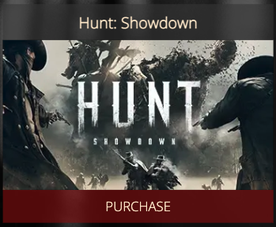

# Hunt Showdown
(Developer: Gary Grant)


[Live Site](https://bovinehero.com/hunt-showdown/index.html) is hosted on github pages with a custom DNS CNAME provided by Google DNS.

## Table of Content

1. [Project Goals](#project-goals)
    1. [User Goals](#user-goals)
    2. [Client Goals](#client-goals)
2. [User Experience](#user-experience)
    1. [Key Information on the Site](#key-information)
    2. [Target Audience](#target-audience)
    3. [User Requrements and Expectations](#user-requrements-and-expectations)
    4. [User Stories](#user-stories)
3. [Design](#design)
    1. [Design Considerations](#design-considerations)
    2. [Colour](#colour)
    3. [Fonts](#fonts)
    5. [Imagery](#imagery)
    4. [Structure](#structure)
    5. [Wireframes](#wireframes)
4. [Technologies Used](#technologies-used)
    1. [Languages](#languages)
    2. [Frameworks & Tools](#frameworks-&-tools)
5. [Features](#features)
    1. [Future Implementations](#future-implementations)
    2. [Accessibility](#accessibility-features)
6. [Testing](#validation)
    1. [HTML Validation](#HTML-validation)
    2. [CSS Validation](#CSS-validation)
    3. [Accessibility](#accessibility)
    4. [Performance](#performance)
    5. [Device Testing](#performing-tests-on-various-devices)
    6. [Browser Compatibility](#browser-compatability)
    7. [Testing User Stories](#testing-user-stories)
8. [Bugs](#bugs)
9. [Deployment & Local Development](#deployment)
10. [Credits](#credits)
11. [Acknowledgments](#acknowledgments)

## Project Goals 

### User Goals
+ To allow people to be able to sign up for updates on the game.
+ See example gameplay 
+ Purchase the game and it's DLC.
+ Find information on what the game is about.
+ Locate the company's office.

### Client Goals
+ Promote the game.
+ Allow players to buy the game and additional DLC content.
+ Provide a way for new and existing players to contact the company.
+ Deliver information about the game to players.

## User Experience

This site is a (fake) marketing site for the popular battle-royal & PVE game [Hunt Showdown](https://www.huntshowdown.com/) made by Crytek.
As a Player vs Player, Player vs Environment battle royal game in a fictional Weird West setting this video game offers a refreshing take on battle royale multiplayer games.
Due to a recent growth in popularity Crytek has recently invested in the development of new content and wants to bring even more players into the game.

As a marketing site the main from the site is to enable sales to new and existing players and promote a way for them to keep up to date with new developments.

### Key Information on the Site
+ A description of what Hunt Showdown is.
+ How to buy the main game and it's DLC.
+ A way to sign up for news and get to the social media of the company.
+ Images depicting the main game and its themes.

### Target Audience
+ PC gamers aged between 18 and 35
+ People looking for high risk, high reward competitive multiplayer
+ Existing Players looking for more Information / Content
+ People that like dark horror and western genres.

### User Requirements and Expectations

+ A simple and intuitive navigation system
+ Quickly and easily find information
+ Links and functions that work as expected
+ Good presentation and a visually appealing design that fits within the hunt theme regardless of screen size
+ An easy way to contact the company
+ Simple content that the user can skim read
+ Accessibility

### User Stories

#### First Time Visitor
1. I would like to know more about the game in order to make a decision should I buy it.
2. I want to be able to navigate the site easily to find information.
3. I would like to be able to be able to go and purchase this game from the site.
4. I would like to be informed of upcoming events, features and community events.
5. I would like to be able to contact the company

#### Returning Players
6. I would like to be able to be able to go and purchase additional content for this game from the site.
7. I would like to be informed of upcoming events, features and community events

#### Site Owner 
8. I want users to find news about upcoming events or changes in the game
9. I want users to be able to get a feel for the game's themes
10. I want the users to be able to contact us


## Design

### Design Considerations

Initially I looked into building this site desktop first rather than a mobile first, however while this provided ample learning opportunities it was not conducive to good design practice as positioning and sizing became a common cause for code refactors. Ultimately this led to a refactor of the initial build into a mobile responsive site after I had generated the base content in a large screen size.

### Colour


Hunt is an atmospheric horror game and so the colour pallette needed to match this dark theme, to enhance the 'hidden threat' and hiding in the shadows aspects of the game a dark background with contrast coming from lighter text was chosen. Highlights on our to calls to action would need to be a single colour addition to break through the light and dark contrasts. 

The colour palette was created using the [Coolors](https://coolors.co/) website.

### Fonts

Google Fonts was used for the following fonts:

+ __Crimson Pro__ is used for headings on the site. It is a serif font based on an updated version of the __Crimson Text__ serif typeface used on the Hunt: Showdown [website](https://www.huntshowdown.com/).

+ __Open Sans__ is used for the body text on the site. It is a sans-serif font and was selected for readibility as it designed for legibility across print, web, and mobile interfaces.

### Imagery

As a faux advertising site, text components should have a minimum reliance on text, instead the focus should be on pictures and graphics to advertise what the game is like for potential players.

The images used within the site are all available in the public presspack available from the Hunt: Showdown [website](https://www.huntshowdown.com/).

### Structure

The page is structured in a well know, recognizable, user friendly, and easy to learn way. Upon arriving to the website the user sees a familiar type of navigation bar with the restaurant logo on the left side and the navigation links to the right. 
The website consists of four separate pages: 
+ A homepage with reviews, media, product description and a purchase the game call to action sections.
+ A store page where potential players can buy yhe game and it's DLC.
+ A image gallery with images showcasing the general feel of the game through concept art and gameplay screenshots.
+ A signup page with a signup form, a map and information about how to contact the business.

Additionally there is a 404 page included that will return the website user to the home page.

### Wireframes

Wireframes were created for desktop as a desktop first approach was initially considered, the wireframes below show the initial concept for the site. 
<br>
<details>
<summary>Home Page Wireframe </summary>
<br>

</details>
<br>
<details>
<summary>Store Page Wireframe</summary>
<br>

</details>
<br>
<details>
<summary>Gallery Page Wireframe</summary>
<br>

</details>
<br>
<details>
<summary>Sign UP  Page Wireframe</summary>
<br>

</details>
<br>
<details>
<summary>404 Page Wireframe</summary>
<br>

</details>
<br>
Later iterations of the CSS flipped to mobile first approach, changes were adapted on the fly to work with the smaller screen size. I did not generate fresh wireframes for the mobile approach as changes were organic based on trial and error and user feedback.

## Technologies Used

### Languages

HTML and CSS were used to create this website.

### Frameworks & Tools

[Balsamiq](https://balsamiq.com/wireframes/) - Used to for wireframes.

[Github](https://github.com/) - To save and store the files for the website and for version control.

[Github Pages](https://pages.github.com/) (Jekyll) - to host the site 

[W3C validator](https://validator.w3.org/) - to test for syntax errors in HTML code

[Jigsaw CSS validator](https://jigsaw.w3.org/css-validator/) - check for syntactic errors in the css code 

[WAVE Web Accessibility Evaluation Tool](https://wave.webaim.org/) - check accessibility

[Google Fonts](https://fonts.google.com/about) - fonts used on the website were imported from here

[Font Awesome](https://fontawesome.com/search) - for iconography on the website

[Google Dev Tools](https://developer.chrome.com/docs/devtools/) - troubleshooting and testing features as well as implement responsive styling

[GitPod](https://www.gitpod.io/) - for active development 

[Code Institute Development Template](https://github.com/Code-Institute-Org/gitpod-full-template) - for setting up the initial development environment

[Tiny PNG](https://tinypng.com/) - compressing images.

[ezgif](https://ezgif.com/) image conversion to webp

[Coolors.co](https://coolors.co/) for colour pallette image

[Favicon.io](https://favicon.io/) - create favicon.

[Am I Responsive?](https://ui.dev/amiresponsive) - prototyping website image on a range of devices.

[Google DNS](https://developers.google.com/speed/public-dns) - hosting name resolution

[Jira Cloud](https://www.atlassian.com/software/jira/free) - project management and task breakdown


## Features
The website is comprised of five pages, four of which are accessible from the navigation menu (index/home page, store page, gallery page and the sign up (Join the Posse!) page). The fifth page is a 404 page which which will return the user to th ehome page should they click on an expired link within the site.

+ All Pages on the website have:

  + A responsive navigation bar at the top which allows the user to navigate through the site. To the left of the navigation bar is the logo text and to to the right of the navigation bar is an animated CSS hamburger menu which gives access to the website pages. To allow a good user experience of the site, the navigation bar is a minimal height and sticky to allow intra site navigation at any point in scrolling the various pages. The hamburger was implemented to give the site a clean look and to promote a good mobile first user experience, anecdotally users are used to seeing the burger icon when on mobile devices to navigate a site, and because a non javascript burger menu would provide ample practice with CSS animations I adapted code from [Erik Terwan](https://codepen.io/erikterwan/pen/EVzeRP) to implement the CSS burger.
    + Nav menu closed. <br> 

    + Nav menu open. <br> 

  + A footer which contains social media icon links to Facebook, Twitter, YouTube, Instagram, Discord, GitHub and GitLab pages. Additionally there is also a note of copyright for my work. Icons were used to keep the footer clean and tight and because they are universally recognisable.
    + Footer. <br> 

  +  As this project is part of a portfolio of work hosted on my personal domain of bovinehero.com I included my favicon image from the parent site which thanks to the github hosting engine auto presents itself in the address tab of the website. 
     + Custom Hosting URL. <br> 

  + A :cowboy_hat_face: emoji in the title of every page. I did this because game is set in the 1890s Lousisiana cowboys are a part of the theme and more importantly because I can and development without a little whimsy is a job.

  + with the exception of 404.html an external stylesheet __assets/css/main.css__. I chose to follow the scss naming convention of 'main.css' for this as (while not in scope here) in future projects may wish to look at thematic style toggles and varaiblising style settings in future projects.

  + keyword and description content for SEO as recommended by best practice. (Gallery Example)
    ``` html
    <meta name="keywords" content="hunt showdown, hunt, huntz">
    <meta name="description" content="Gallery of Concept art and screen captures from Hunt: Showdown as part of Code Institute work">
    ```

  + An image as a fixed background image with a black fallback to aid with simulating the atmosphere in the game. In smaller screens a scroll down will eventually take a user to the end of the image, but in larger screens it fills it regardless of scrolling position. 

+ index.html
  
  + Hero Banner: contains an animated reverse zoom of a hunter in an effort to give the site a level of dynamisism on landing along with fixed text to ephasise the mood of the game.
    + A big driver in the game is that a single shot can kill and often that shot comes in the dark from an unkown location, both the image and the zoom out we selected to try and achieve this effect.
    + For accessibility this animation is deactivated via a `prefers-reduced-motion` media query in `main.css`
    + The fixed text over the banner image has a colour change to blood red of the `<span>die alone.</span>`, to highlight the frailty your player character has in the game. The transition here is slower and doesn't include motion so the color change persists over reduced motion preference.
    + Hero banner: <br> 
  
  + Testimonials: a flex row wrapped div with a title and 3 favourable reviews of the game.
  
  + YouTube Media: The official launch trailer from the youtube site for the game developed by Crytek.
    + Initially I'd considered a video section here, but the constraints of gitlab and lack of suitable content prompted a flip into using a YouTube iframe for the media section. 
    + As an exteranl resource I added in `loading="lazy"` to tag the iframe as a non-blocking asset and make it load only as needed.
    + The resolution sizes for the base iframe I implemented as a default 16:9 (as per the source video) and incremented the pixel sizes up through multiples of this ratio from 384px by 216px to 1600px by 900px in subsequent media screen sizes. This way the user sees a good portion of the content creator's video cover in their screen.
  
  + Product Description: the main text description of Hunt: Showdown from the publisher's [store](https://eu-shop.crytek.com/games/hunt-showdown) stylised responsivley to fit within the site. 
    + Following the natural flow of the site, after some attention grabbing multi-media content this part explains to the user what the game is and how it works. This section uses a flex column to center the content.

  + Purchase Links: This is the call to action of the page, where upon viewing the content a new player consumer will be inspired to purchasing the game.
    + The code here is a re-implemetation of the code in the __Purchase Game__ section of the store page.

+ store.html 

  + Game and DLC Purchase Links: These are calls to action components of the site, arranged on 2 flex row 'shelves' with the games being the top row and the DLC the lower one.

    + The store page provides links out two versions of the game, one from the official crytek store and an additional collectors edition in steam. 
    + The user can also head out to the official store view a selection of DLC from the game.
    + On larger screens this is presented as 2 distinct rows, but the use of flex wrap ensures that on smaller screens this moves naturally into a column view without the need to refactor.
    + For the DLC items I elected for fixed narrower width so that the text and background image for the store item would remain consistent within screen sizes and to allow a bit more content on a row.
    + I wanted the game purchase boxes to be fairly large on the page to consume more real estate on a row in both the index and store pages. However the available image sizes limited the box sizes to around 400px (double the width) of the DLC components.
    + Game Purchase: <br> 
    + DLC Purchase: <br> 

+ gallery.html

  + Assorted image size gallery: a composed of of various media from a press pack download the official Hunt Showdown [site](https://www.huntshowdown.com/media) arranged into a column defined section.
    + I implemented a column-gap in the section to provide horizontal spacing and set the image widths to be 100% of the column in order to make resizing easy for a single image source.
    + Smaller screens recieve a single column containing pictures as the default, screen resolutions increase the number of columns gradually increase to 4 via use of media queries, ensuring the gallery consumes more of the screen as it gets larger.
    + Gallery in narrow (portrait) view: <br> 
    + Gallery in wide (landscape) view: <br> 

+ signup.html

  + Signup Form:  
    + this was heavily influenced by the love running project within the course. Originally I'd planned for this to be a modal either launched from the footer or in the sticky menu but could not work out a clean way to do this without javascript.
    + The production version uses flex to share space with the map, however it was originally implemented as:
      + By default the form is positioned to the left by default and use all the horizontal space with a max-width of 100%, fixed padding size or 30px but a flexible 10% margin. This was in an attempt to make it use as much space as possible without consuming the entire screen asthetically pleasing in smaller screens. 
      + As the viewing port becomes larger we use proportionally reduce the max-width in the media queries to avoid making the form look stretched accross the section. - By the time we get to the largest screen sizes, we have a small form on the left and can view the entire background picture in the section. 
    + The form uses client side validation for the email address via the following regex: `pattern="[a-z0-9._%+-]+@[a-z0-9.-]+\.[a-z]{2,4}$"`
    + The submitters Name is not required as this constitutes PII, which we don't need in order to send someone an email style news letter. PII needs robust data handling practices, this ids an overhead I do not want to manage at this stage.
    + Newsletter Signup form: <br> 

  + Map & Contact Us:
    + This feature was a late addition to the project based on user feedback and was added to the form section prompting a refactor from point positioning to flex
    + There is a mailto link as well as a google maps iframe import to a location deep in the Louisana Bayou, whee the game takes place.
    + Map & contact us: <br> 


+ 404.html

  + Leverages the github pages jekyll engine to provide a custom 404 experience for users. 
    + Styling here is inline as any http calls to child directories cannot be reliably referneced by links in the header, specifically users could manually input non-existing child directories into the url bar and would not see the styling.
    + Similarly the link back to the home page needs to directly reference the home url [https://bovinehero.com/hunt-showdown/index.html](https://bovinehero.com/hunt-showdown/index.html) as relative referencing will not guarantee a return to the home page if non-existant child directories are inputted into the url.
    + Link back home: <br> 

### Future Implementations

+ The signup page currently bounces it's request off of the CI testing API, a future enhancement would be deal with this in the page.
+ Change the signup page to be Modal launched as a discreet call to action that scrolls with the user. I was unable to work out how to implement a modal without JavaScript
+ I would like to have implemented a colour switcher to allow for different color deficient vision types. I researched dark mode and css theme switches to try and work out a way to implement this. However within the timeframe I had allocated for the project I was unable to deliver on this without the use of javascript. 
+ Additionally I considered implementing a font switcher to leverage the [OpenDyslexic](https://opendyslexic.org/) font as a switchable font face but again the implementation seemed dependent on javascript.
+ The copyright section includes a date, I would like to have this updated based on the current year to lazy maintain the site, but I could not find a way to pull the date without server-side input or JavaScript.
+ An interactive gallery to include of smaller images on the gallery wall on page load and larger ones when focus is shifted or image is selected for download. Again I could not find a way to create this functionality without JavaScript.

### Accessibility
I have been mindful during coding to ensure that the website is as accessible friendly as possible. I have achieved this by:

+ Using semantic HTML.
+ Using descriptive alt attributes on images on the site.
+ Providing information for screen readers where there are icons used and no text - such as the review ratings for books & footer icons.
+ Ensuring that there is a sufficient colour contrast throughout the site.
+ Ensuring menus are accessible by marking the current page as current for screen readers.

> OpenDyslexic should be a consideration for future projects.  I considered implementing a specialist typeface to try and eliviate common symptoms dyslexia either as the primary fontface or as a switchable style.  With a little research I discovered the [OpenDyslexic](https://opendyslexic.org/) font which provided the means to meet this requirement, however as the primary font it detracted from the asthetic of the site. Instead I looked into implementing a switchable stylesheet for accessibility however implementation seemed dependent on either javascript or serverside technologies - both of which were out of scope for this project.

## Testing

### HTML Validation

The W3C Markup Validation Service was used to validate the HTML of the website. 

index.html [results](https://validator.w3.org/nu/?doc=https%3A%2F%2Fbovinehero.com%2Fhunt-showdown%2Findex.html) - No Errors Found

1 Warning displayed

| **Level** | **Feature** | **Issue Description** | **Comment** |
|-------------|-------------|----------------------|-------------|
| Warning | `<section id="media-section">` | Section lacks heading. Consider using h2-h6 elements to add identifying headings to all sections, or else use a div element instead for any cases where no heading is needed. | section includes an iframe with appropriate title as the only content for additional semantic information |

store.html [results](https://validator.w3.org/nu/?doc=https%3A%2F%2Fbovinehero.com%2Fhunt-showdown%2Fstore.html) - No Errors Found

gallery.html [results](https://validator.w3.org/nu/?doc=https%3A%2F%2Fbovinehero.com%2Fhunt-showdown%2Fgallery.html) - No Errors Found

1 Warning displayed

| **Level** | **Feature** | **Issue Description** | **Comment** |
|-------------|-------------|----------------------|-------------|
| Warning | `<section id="gallery">` | Section lacks heading. Consider using h2-h6 elements to add identifying headings to all sections, or else use a div element instead for any cases where no heading is needed. | Section includes an image content only with appropriate alt tags and is preceeded with a page title section |

signup.html [results](https://validator.w3.org/nu/?doc=https%3A%2F%2Fbovinehero.com%2Fhunt-showdown%2Fsignup.html) - No Errors Found

### CSS Validation

The W3C Jigsaw CSS Validation Service was used to validate the CSS of the website.

site [results](https://jigsaw.w3.org/css-validator/validator?uri=https%3A%2F%2Fbovinehero.com%2Fhunt-showdown%2F&profile=css3svg&usermedium=all&warning=1&vextwarning=&lang=en) - No Error Found.

11 Warnings which were implemented in order to try and preserve the autofill experience between browsers:

| **Feature** | **Issue Description** |
|-------------|----------------------|
| .text-input:autofill |	Same color for background-color and border-top-color |
| .text-input:autofill |	Same color for background-color and border-right-color |
| .text-input:autofill |	Same color for background-color and border-bottom-color |
| .text-input:autofill |	Same color for background-color and border-left-color |
| | :-webkit-autofill is a vendor extended pseudo-class |
| .text-input:-webkit-autofill |	Same color for background-color and border-top-color |
| .text-input:-webkit-autofill |	Same color for background-color and border-right-color |
| .text-input:-webkit-autofill |	Same color for background-color and border-bottom-color |
| .text-input:-webkit-autofill |	Same color for background-color and border-left-color |
|	| :-ms-input-placeholder is a vendor extended pseudo-class |
|	::-ms-input-placeholder is a vendor extended pseudo-element |

More information about this in the [Bugs](#bugs) section

### Accessibility

The WAVE WebAIM web accessibility evaluation tool was used to ensure the website met high accessibility standards.

+ index.html [results](https://wave.webaim.org/report#/https://bovinehero.com/hunt-showdown/index.html)

+ gallery.html [results](https://wave.webaim.org/report#/https://bovinehero.com/hunt-showdown/gallery.html)

+ store.html [results](https://wave.webaim.org/report#/https://bovinehero.com/hunt-showdown/store.html)

+ signup.html [results](https://wave.webaim.org/report#/https://bovinehero.com/hunt-showdown/signup.html)

All of the pages shared the same issues

#### Errors

In every Page Header there is An Error stating __A form label is present, but does not contain any content.__
Meaning the form label is associated with an existing form control (using for/id or surrounds the form control), but does not contain any text or images with alternative text.

The content for this is section is the CSS hamburger menu, it is animated CSS and so cannot have any text or images with alternative text:

``` css
<input class="side-menu" type="checkbox" id="side-menu"/>
<label class="burger" for="side-menu"><span class="burger-line"></span></label>
```

I have tried to address this by referencing the functionality as a checkbox so a user 'on click' will get access to the menu, the label addresses the relationship in it's for.

Because the animation that manipulates the menu is a css manipulation a screen reader should still be able to refernce the menu anyway, the code below is not dynamically generated it is just obfuscated from view: 

``` html
<nav class="nav-menu">
  <ul class="menu">
      <li><a href="index.html">Home</a></li>
      <li><a class="active" href="store.html">Store</a></li>
      <li><a href="gallery.html">Gallery</a></li>
      <li><a href="signup.html">Join the Posse!</a></li>
  </ul>
</nav>
```

#### Alerts

This also ties into the Alert seen on every page: __Adjacent links go to the same URL__
The Nav Bar positioning is beside the logo text, both of which have links back to the home (index.html) page. It is common (if not expected) convention for the logo to take a user home in addition to a link back to the home page.

The Index page has an alert to __Ensure that YouTube video presents equivalent, synchronized captions__. This video doesn't have captions outside of the auto generated ones on YouTube Website. However as the media content was the offical video trailer for the game from the publisher I felt changing this to a captioned video is out of scope for this project.

### Performance

Performance testing was performed on lighthouse in Google Chrome's DevTools

#### index.html


Issues:

| **Section** | **Feature** |**Issue Description** | **Comment** |
|-------------|-------------|----------------------|-------------|
| Performance | Site Loadins | Serve static assets with an efficient cache policy | Limitation of gitpages as this is a serverside fix |
| Performance | YouTube Video | Some third-party resources can be lazy loaded with a facade | Facade placeholder requires JavaScript, beyond scope of project |
| Performance | YouTube Video | Does not use passive listeners to improve scrolling performance | Imported from the video, this is a JavaScript optimization, beyond scope of project |

#### store.html


Issues:

| **Section** | **Feature** |**Issue Description** | **Comment** |
|-------------|-------------|----------------------|-------------|
| Performance | Site Loadins | Serve static assets with an efficient cache policy | Limitation of gitpages as this is a serverside fix |

#### gallery.html


Issues:

| **Section** | **Feature** |**Issue Description** | **Comment** |
|-------------|-------------|----------------------|-------------|
| Performance | Site Loadins | Serve static assets with an efficient cache policy | Limitation of gitpages as this is a serverside fix |
| Performance | Gallery images | Serve images that are appropriately-sized to save cellular data and improve load time | An image resize is in the range of kbs per image, as the site is not based in high speed realtime transactions I decided to preserve the original sizes for better quality on download rather than page view. |


#### signup.html


Issues:

| **Section** | **Feature** |**Issue Description** | **Comment** |
|-------------|-------------|----------------------|-------------|
| Performance | Site Loadins | Serve static assets with an efficient cache policy | Limitation of gitpages as this is a serverside fix |
| Performance | Map IFrame | Does not use passive listeners to improve scrolling performance | Does not use passive listeners to improve scrolling performance | Imported from the video, this is a JavaScript optimization, beyond scope of project |


### Device testing
The website was tested on the following devices:

1. MacBook Pro
2. IPhone 13
3. In addition, the website was tested using Google Chrome Developer Tools Device emulation for all available device options plus a custom setting for IPhone 5


### Browser Compatibility
The website was tested on the following browsers:

1. Google Chrome
2. Mozilla Firefox

### Testing user stories

1. As a __First Time Visitor__, I would like to know more about the game in order to make a decision should I buy it.

| **Feature** | **Action** | **Expected Result** | **Actual Result** |
|-------------|------------|---------------------|-------------------|
| Gallery | Navigate to the Gallery Page and scroll up and down | gallery images are rendered visible in the screen for a variety of screen sizes  | Works as expected |
| YouTube Video | Navigate to index page scroll to YouTube video and click on it | YouTube player should start the video with imbedded YouTube controls | Works as expected |
| Product Description | Navigate to index page scroll to product description section | text describing the game should be legible on a a variety of screen sizes  | Works as expected |
| Product Testamonials | Navigate to index page scroll to testamonials section | citations with product reviews be legible on a a variety of screen sizes| Works as expected |

2. As a __First Time Visitor__, I want to be able to navigate the site easily to find information.

| **Feature** | **Action** | **Expected Result** | **Actual Result** |
|-------------|------------|---------------------|-------------------|
| Header Nav Menu | At anytime click on the header hamburger menu when scrolling up or down on any page | display nav links to the other pages | Works as expected |

3. As a __First Time Visitor__, I would like to be able to be able to go and purchase this game from the site.

| **Feature** | **Action** | **Expected Result** | **Actual Result** |
|-------------|------------|---------------------|-------------------|
| Home Page Purchase | Navigate to bottom of the Index Page and click the __purchase__ block | Link opens in a new tab to a store where a purchase of the item can be made | Works as expected |
| Game Edition Purchase | Navigate to the Store Page and DLC section, click on the __purchase__ block | Link opens in a new tab to a store where a purchase of the item can be made | Works as expected |
| DLC Purchase | Navigate to the Store Page and DLC section, click on the the __purchase__ block | Link opens in a new tab to a store where a purchase of the item can be made | Works as expected |


4. As a __First Time Visitor__, I would like to be informed of upcoming events, features and community events.

| **Feature** | **Action** | **Expected Result** | **Actual Result** |
|-------------|------------|---------------------|-------------------|
| Sign Up for the Hunt! form | Navigate to the Join the Posse! (Sign Up) Page and locate the Sign Up for the Hunt! form, fill out and submit | Data submited via contact form | Works as expected |
| Footer |  Navigate to the bottom of any page and click on a social media icon | open a link to social media where live updates can be found | Works as expected |

5. As a __First Time Visitor__, I would like to be able to contact the company

| **Feature** | **Action** | **Expected Result** | **Actual Result** |
|-------------|------------|---------------------|-------------------|
| Footer |  Navigate to the bottom of any page and click on a social media icon | open a link to social media where customers can engage | Works as expected |
| Email | Navigate to the Join the Posse! (Sign Up) Page and locate the Find us in the Bayou Map, click on the email icon | If email client is installed, draft an email should appear |  Works as expected |
| Map | Navigate to the Join the Posse! (Sign Up) Page and locate the Find us in the Bayou Map, click on the map | User can explore the area near the address on google maps |  Works as expected |


6. As a __Returning Player__, I would like to be able to be able to go and purchase additional content for this game from the site.

| **Feature** | **Action** | **Expected Result** | **Actual Result** |
|-------------|------------|---------------------|-------------------|
| DLC Purchase | Navigate to the Store Page and DLC section, click on the __purchase__ block | Link opens in a new tab to a store where a purchase of the item can be made | Works as expected |

7. As a __Returning Player__, I would like to be informed of upcoming events, features and community events

| **Feature** | **Action** | **Expected Result** | **Actual Result** |
|-------------|------------|---------------------|-------------------|
| Sign Up for the Hunt! form | Navigate to the Join the Posse! (Sign Up) Page and locate the Sign Up for the Hunt! form, fill out and submit | Data submited via contact form | Works as expected |
| Footer |  Navigate to the bottom of any page and click on a social media icon | open a link to social media where live updates can be found | Works as expected |

8. As the __Site Owner__, I want users to find news about upcoming events or changes in the game

| **Feature** | **Action** | **Expected Result** | **Actual Result** |
|-------------|------------|---------------------|-------------------|
| Sign Up for the Hunt! form | Navigate to the Join the Posse! (Sign Up) Page and locate the Sign Up for the Hunt! form, fill out and submit | Data submited via contact form | Works as expected |
| Footer |  Navigate to the bottom of any page and click on a social media icon | open a link to social media | Works as expected |

9. As the __Site Owner__, I want users to be able to get a feel for the game's themes

| **Feature** | **Action** | **Expected Result** | **Actual Result** |
|-------------|------------|---------------------|-------------------|
| Gallery | Navigate to the Gallery Page and scroll up and down | gallery images are rendered visible in the screen for a variety of screen sizes  | Works as expected |
| YouTube Video | Navigate to index page scroll to YouTube video and click on it | YouTube player should start the video with imbedded YouTube controls | Works as expected |
| Product Description | Navigate to index page scroll to product description section | text describing the game should be legible on a a variety of screen sizes  | Works as expected |
| Product Testamonials | Navigate to index page scroll to testamonials section | citations with product reviews be legible on a a variety of screen sizes| Works as expected |

10. As the __Site Owner__, I want the users to be able to contact us

| **Feature** | **Action** | **Expected Result** | **Actual Result** |
|-------------|------------|---------------------|-------------------|
| Footer |  Navigate to the bottom of any page and click on a social media icon | open a link to social media where customers can engage | Works as expected |
| Email | Navigate to the Join the Posse! (Sign Up) Page and locate the Find us in the Bayou Map, click on the email icon | If email client is installed, draft an email should appear |  Works as expected |


## Bugs

### Sign Up Page auto-complete
The SignUp page includes css styling for form auto-complete that includes both background color and text color. These will not implemnt on every browser as user agent style sheets of many browsers use `!important` in their `:-webkit-autofill` style declarations, making them non-overridable with CSS. 

For example Chrome has the following in its internal stylesheet:

``` css
background-color: rgb(232, 240, 254) !important;
background-image: none !important;
color: -internal-light-dark(black, white) !important;
```

[ref](https://developer.mozilla.org/en-US/docs/Web/CSS/:autofill)

This means auto-fill background-color, background-image, and color cannot be set reliabily without the inclusion of Javascript. 

I did use some vendor specific pseudo components in order to try and establish some form of uniformity for cross browser experience, but the results are not consistent.

## Deployment & Local Development

All of the following steps require a logged in github account.

### Deployment
Github Pages was used to deploy the live website. 
The instructions to achieve this are available [here](https://docs.github.com/en/pages/getting-started-with-github-pages/creating-a-github-pages-site)

### How to Fork
To fork this repository:

1. Go to the repository for this project.
2. Click the Fork button in the top right corner.

### How to Clone
To clone this repository:

1. Go to the repository for this project.
2. Click on the code button, select whether you would like to clone with HTTPS, SSH or GitHub CLI and copy the link shown.
3. Open the terminal in your code editor and change the current working directory to the location you want to use for the cloned directory.
4. Type 'git clone' into the terminal and then paste the link you copied in step 3. Press enter.

## Credits

### Code Used

[W3C Schools](https://www.w3schools.com/) for proof of concept attempts
[css-tricks](https://css-tricks.com/snippets/css/a-guide-to-flexbox/) for a primer on flexbox
[mdm web docs](https://developer.mozilla.org/en-US/docs/Learn/CSS/CSS_layout) for various
Love Running for inspiration on the Sign UP form and animation primer on hero banner.
[Erik Terwan](https://codepen.io/erikterwan/pen/EVzeRP) for how to implement a CSS burger


### Content
Text Content for the website was written by the Crytek Employees and was ourced from the store [Page](https://eu-shop.crytek.com/games/hunt-showdown).
Block quotes for testamonials are cited within the web documents.

### Media
Images from the official Hunt Showdown [site](https://www.huntshowdown.com/media) presspack
Images from the Crytek Store [Page](https://eu-shop.crytek.com/games/hunt-showdown)
Collector's edition from the Steam Store [Page](https://store.steampowered.com/bundle/12841/Hunt_Showdown__Collectors_Edition/)
YouTube Video from the official Crytek YouTube [Channel](https://www.youtube.com/c/HuntShowdown)

## Acknowledgments
I would like to acknowledge the following people who helped me along the way in completing my first CI project:

Crytek - Creator Hunt: Showdown for inspiring the site.

Ed Bradly - for his insights into flexbox, grid and why mobile first will save you from headaches

Kera Cudmore & Ana Runje - for providing insight into readme layouts, without it I'd still be typing.

Stuart Grant - for his ruthless (but fair) feedback of a first attempt at a website.

Calumn Dennis & Joao Higino - for their peer feedback, helping to make the site better. 

Mo Shami - for being the mentor that set me on the right path and provided me with mid and final feedback prioir to submission.